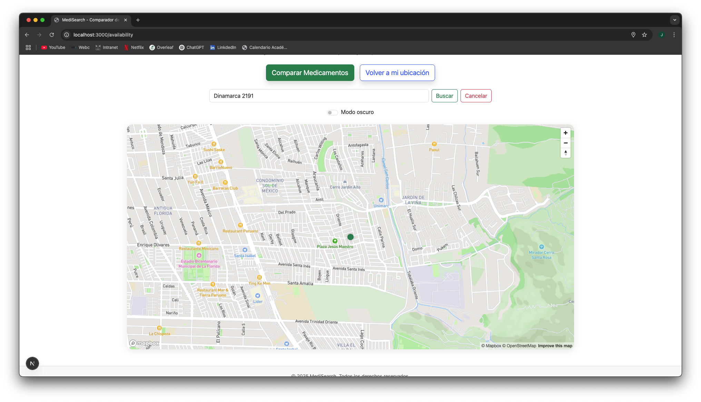
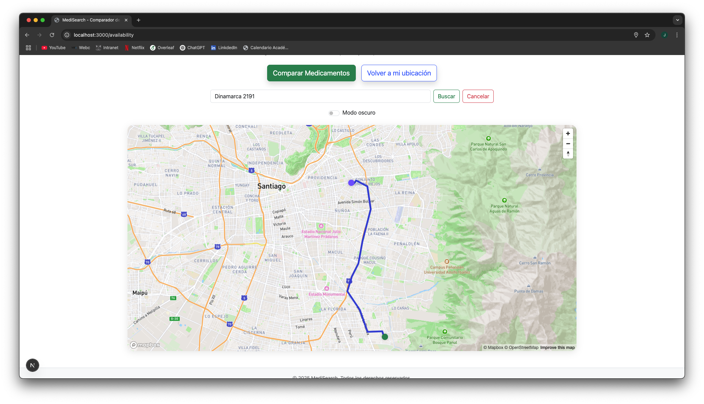
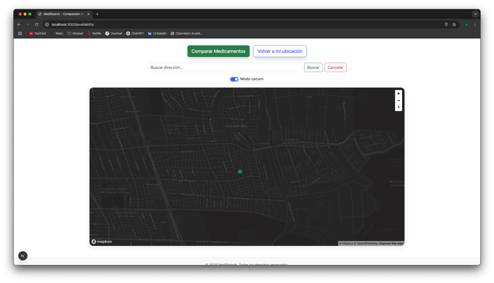
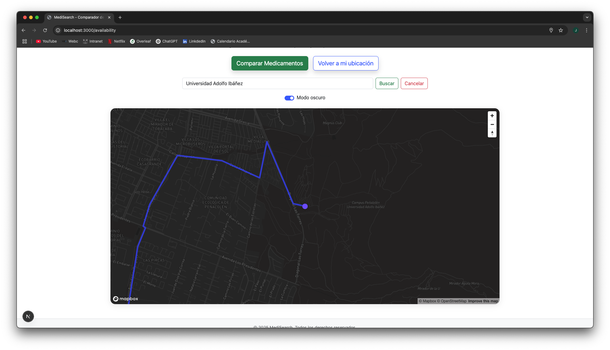

# Testeo de Mapbox
Testeamos *Availability* para ver si la implementación de Mapbox funciona e hicimos 4 pruebas ya que en la fase inicial de Mapbox no nos reconocía la ubicación, es por esto que las pruebas que se hicieron fueron:

1. Detectar ubicación actual en tiempo real
Para esta prueba iniciamos en la página de *Availability* y al cargar la página nos detectó sin problemas la ubicación actual del usuario que ocupaba la página, tal como se adjunta en la imagen:

Si bien al inicio habían algunos metros de desfase, al pasar 5 minutos dentro de la página, Mapbox tomaba más precisión en la ubicación.

2. Buscar direcciones
Previo a la implementación de las ubicaciones de farmacias cercanas, pusimos un navbar de dirección para ver si Mapbox reconocía y respondía a nuestras solicitudes de dirección. Pusimos como ejemplo la dirección *Dinamarca 2191* y nos arrojó justamente donde queda ubicada, como se muestra en la imagen:

3. Aplicación Modo Oscuro
Para la comodidad del usurario, implementamos el *Modo Oscuro* y se ve perfecto, sin opacidades y se pueden leer las direcciones de las calles, junto con las dimensiones correspondientes. De acuerdo a la imagen:

4. Buscar direcciones en Modo Oscuro
Al igual que en el punto 2, utilizamos la navbar de dirección para ver si había algún problema o *bug* con el Modo Oscuro, pusimos otra ubicación la cual fue la *Universidad Adolfo Ibáñez* y de acuerdo a la imagen adjunta tenemos:

Ya con todo esto implementado y testeado, estamos listos para conectar los scrapers y ubicaciones de las farmacias cercanas para que *Availability* tome forma a lo largo de los sprints.