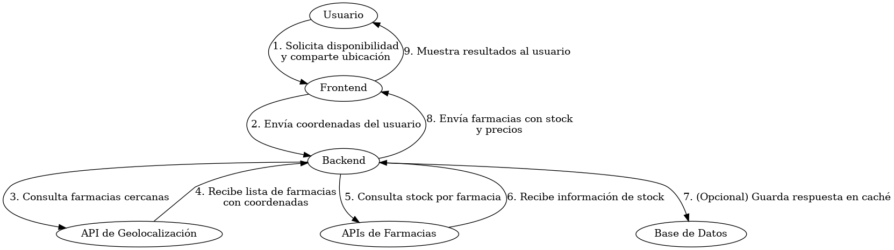

# Describir el flujo de disponibilidad en tiempo real (diagrama de secuencia)

El objetivo es documentar mediante un diagrama de secuencia UML el flujo completo que sigue una consulta de disponibilidad de medicamentos en farmacias cercanas. El diagrama debe incluir al usuario, frontend, backend, APIs externas (geolocalización y farmacias) y base de datos. 

## Diagrama de Secuencia

El siguiente diagrama describe cómo se consulta y obtiene la disponibilidad de un medicamento en tiempo real:

---

## Explicación del flujo

1. El **usuario** entra a la plataforma y, al buscar un medicamento, acepta compartir su ubicación actual para encontrar farmacias cercanas.
2. El **frontend** toma esas coordenadas geográficas y las envía al **backend**, que se encarga de procesarlas.
3. El **backend** hace una consulta a una **API de geolocalización** (como Mapbox) para identificar qué farmacias se encuentran dentro de un cierto radio (por ejemplo, 5 km).
4. Con esa lista de farmacias, el backend luego consulta a distintas **APIs de farmacias** (como Salcobrand, Ahumada, etc.) para saber si el medicamento está disponible en stock.
5. **Importante aclarar que hasta el momento no se ha implementado una base de datos en los sprints desarrollados.** Por lo tanto, toda la información que se obtiene se maneja en tiempo real y no se almacena localmente ni se cachea. Sin embargo, en el futuro está contemplado integrar una **base de datos** para guardar resultados de stock, ubicaciones frecuentes, historial de búsqueda, y mejorar la velocidad de respuesta del sistema.
6. Una vez reunida toda la información (farmacias cercanas con disponibilidad del medicamento, precios, dirección, etc.), el backend la envía de vuelta al **frontend**.
7. Finalmente, el usuario ve los resultados organizados en la interfaz de la plataforma, con la opción de elegir la farmacia más conveniente según distancia o precio.

De todas formas como aún no se ha implementado la base de datos en los Sprints desarrollados hasta el momento, se implementa el concepto de bases de datos para el modelado pero luego más adelantado ya en los Sprints, se especificará en las bases de datos.
